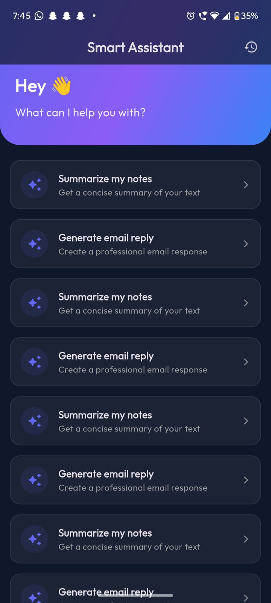
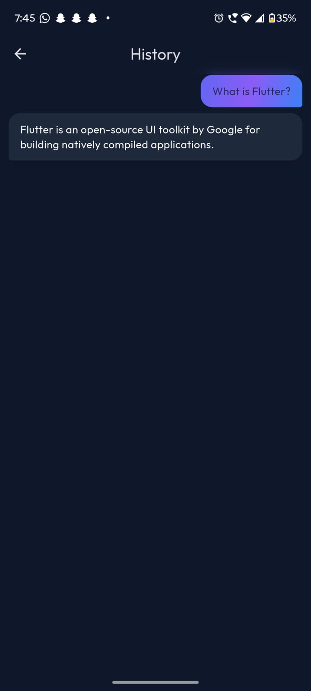
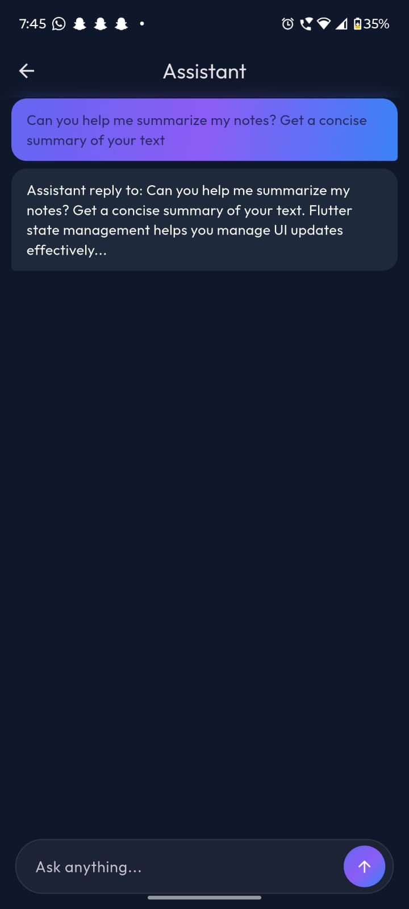

# Smart Assistant App

A simple, assignment-based Flutter app that simulates a mobile AI assistant. It covers a few core flows: fetching a paginated list of suggestions, chatting with the assistant, and viewing past chat history.

The focus here is on clean code, straightforward state management, and a nice, modern UI without over-engineering things.

## Features
- **Home Screen**: Displays a list of prompted suggestions. Supports infinite scrolling with a loading indicator at the bottom.
- **Chat**: A basic chat interface. You can tap a suggestion from the home screen to automatically start a conversation, or just type your own message.
- **History**: Shows a log of previous conversations.
- **Dark Mode**: Automatically adapts to your system theme.

## Architecture & Tech
I kept the architecture as simple as possible. It's built primarily around features rather than strict domain/data layers.

Flow: `UI -> Provider (Riverpod) -> ApiService`

- **State Management**: `flutter_riverpod` (used for clean separation of UI and business logic).
- **Networking/API**: The `ApiService` currently simulates backend responses with `Future.delayed` to mimic real network latency and returns data exactly matching the assignment JSON structure.
- **UI**: Standard Material 3 widgets, with some subtle glassmorphism and gradient touches to make it feel premium but not overly custom or complex.

## Setup & Run
1. Get the dependencies:
   ```bash
   flutter pub get
   ```
2. Run the app:
   ```bash
   flutter run
   ```
3. Run tests (covers model parsing):
   ```bash
   flutter test
   ```

## Folder Structure
- `lib/core/`: Theming and the simulated ApiService.
- `lib/features/`: Divided by feature (`chat`, `history`, `suggestions`). Each contains its own models, providers, and UI screens.
- `lib/widgets/`: Shared UI components like the message bubble and custom loading indicator.

## Screenshots

<div style="display: flex; flex-direction: row; gap: 10px;">
  
  
  
</div>
